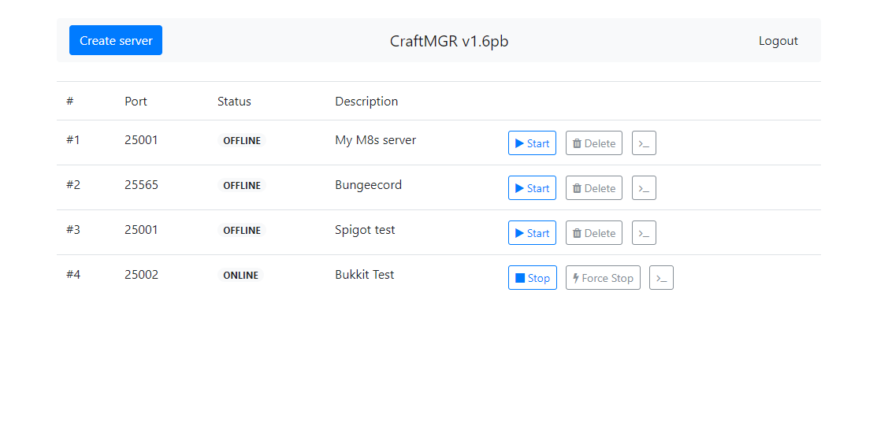
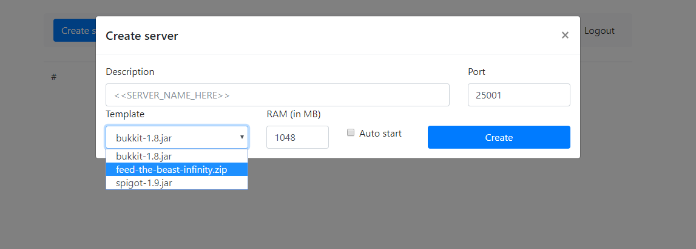
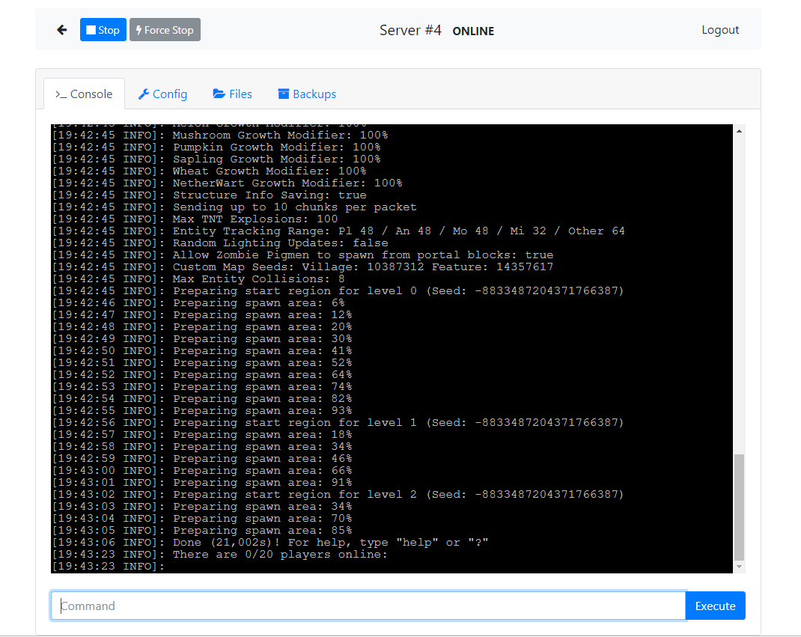
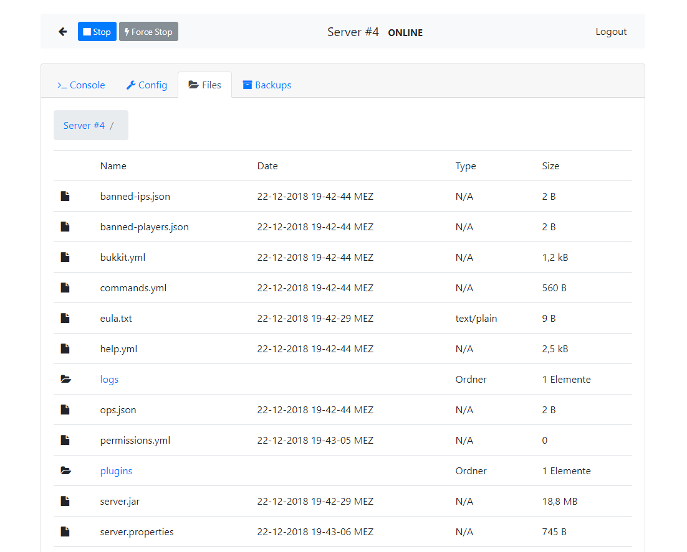

# CraftMGR
The Open-Source Minecraft game server management solution.

### Features
* Run as **many minecraft servers** as your system resources can hold
* Beautiful Bootstrap 4 themed **web interface**, including a
	* Realtime list of all servers
	* Realtime server console view
* Interactive **command line interface**
* **TCP-Socket interface**, for communication with your own application.
* **All server versions supported**, including:
	* CraftBukkit/Spigot
	* BungeeCord
	* Forge
* User-defined **server templates** _(place server.jar or a *.zip archive containing server files into the ```templates``` directory)_
* .ini config files
* BCrypt encrypted passwords

### Screenshots






### Setup
1) Build or get CraftMGR.jar
2) Optional: For additional security, create system user to run it with. ```adduser minecraft```
3) Place CraftMGR.jar into desired directory on your server. e.G. on linux ```/home/minecraft```
4) Run it with ```java -jar CraftMGR.jar```. You may use ```screen``` or a init-script to run it in background
5) Connect via web browser to ```http://<Address of your server>:9000/```
Default password is: ```imnotgerman```
6) Enjoy

### Runtime

Runtime:
- Java 8
- ```screen``` is not required to run :D

Build:
- \>= commons-lang3-3.7
- \>= ini4j-0.5.4
- \>= jbcrypt-0.4
- \>= nanohttpd-2.3.1


## TODOs & planned features:
- Command line interface translation (very sorryy for lack of this!)
- Password change trough UI
- HTTPS Support
- Multi-user support
- Documentation